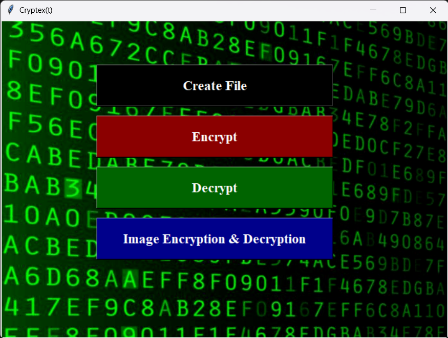
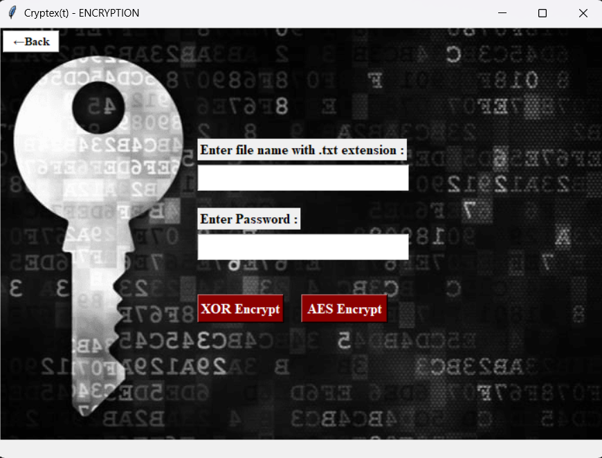
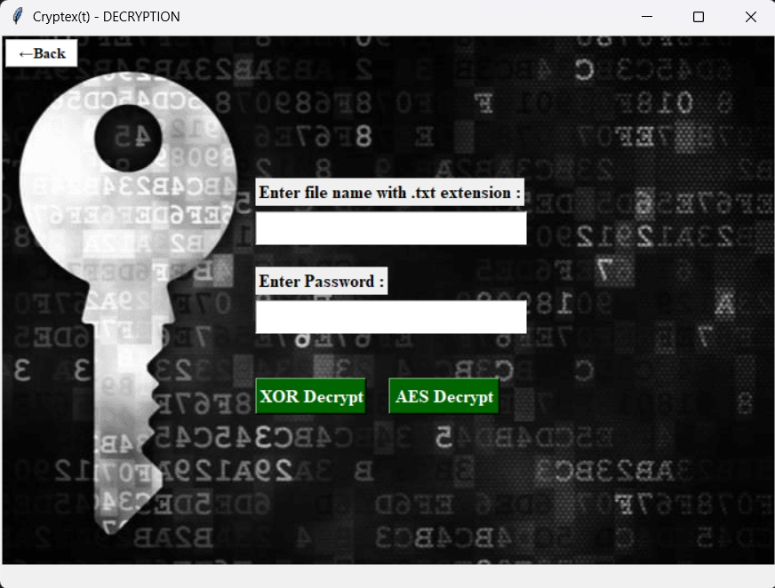
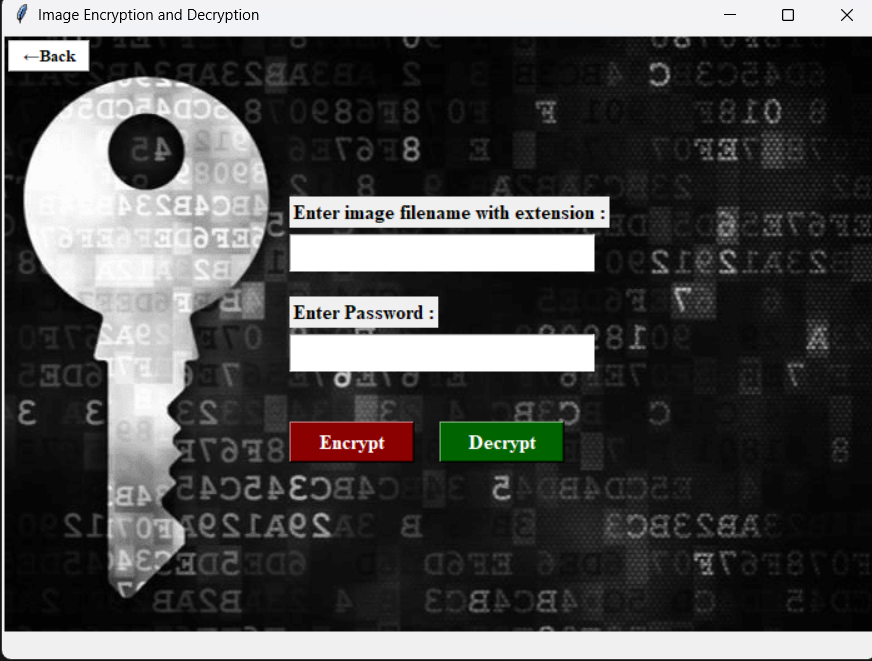

# Cryptext 🔐

Cryptext(t) is my bachelor's college project written in 2020 to demonstrate file encryption and decryption using AES (Advanced Encryption Standard) and XOR cipher.

---

## About

Cryptex(t) was built as a hands-on exploration of cryptographic algorithms. It supports both terminal and GUI modes, allowing users to create, encrypt, and decrypt text and image files using two different encryption methods.

---

## Features

- 🔒 AES Encryption & Decryption
- 🔑 XOR Encryption & Decryption
- 🖼️ Image Encryption & Decryption
- 💾 File creation through the app
- 🗄️ SQLite database to store and validate filename/password pairs
- 🖥️ Tkinter GUI (yes, Tkinter — it was 2020)

---

## Screenshots

### Main Window


### Encryption


### Decryption


### Image Encryption & Decryption


---

## Tech Stack

- Python
- Tkinter (GUI)
- pycryptodome (AES)
- SQLite (built-in, no setup needed)

---

## Getting Started

### Prerequisites
- Python 3.x
- Install dependencies:
```bash
pip install pycryptodome
```

### Run via Terminal
```bash
python ProjectSc.py
```

### Run via GUI
```bash
python Cryptext.py
```

---

## How It Works

**Encryption:**
- Enter the filename and a password
- Choose XOR or AES encryption
- The file is encrypted and the filename/password pair is stored in a local SQLite database

**Decryption:**
- Enter the filename and the same password used during encryption
- If the pair matches the database record, the file is decrypted
- A mismatch means the file cannot be decrypted

---

## Project Structure

```
Cryptext/
├── assets/               # Background images
├── Cryptext.py           # GUI entry point
├── Encrypt.py            # Encryption window
├── Decrypt.py            # Decryption window
├── CreateFile.py         # File creation window
├── Image_Enc.py          # Image encryption window
├── ProjectSc.py          # Terminal entry point
├── requirements.txt
└── .gitignore
```
